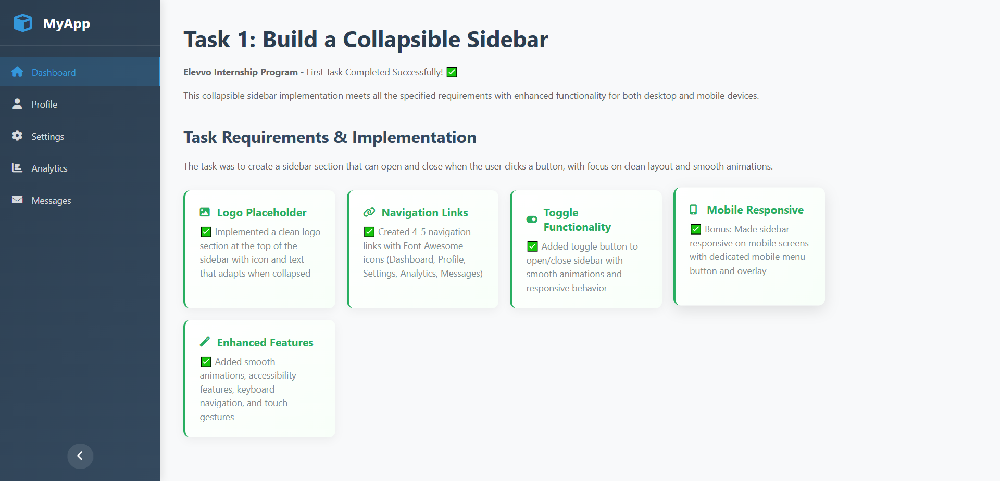
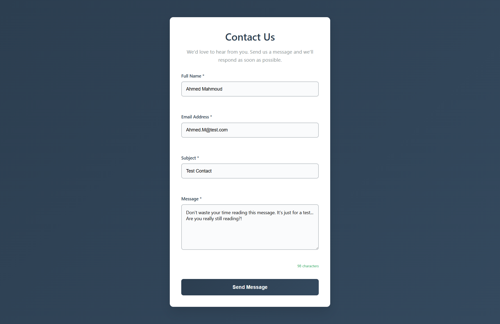
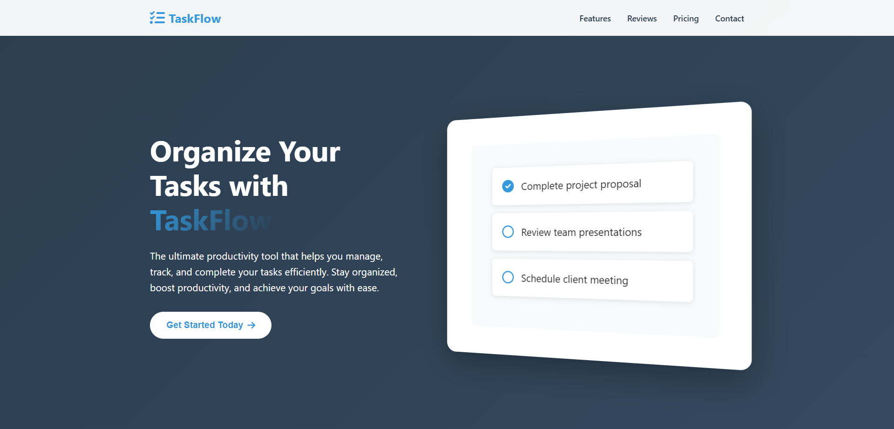
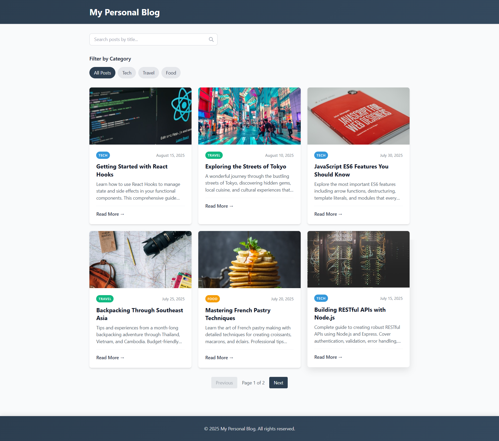
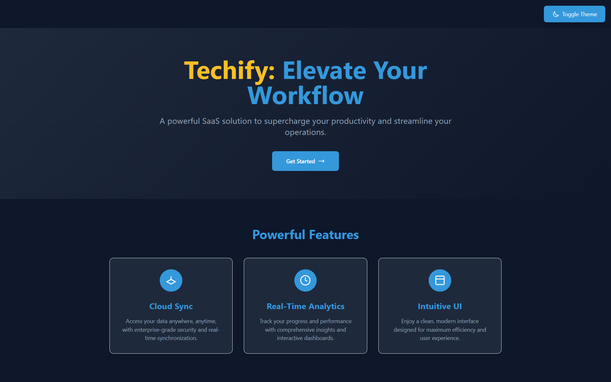

# Elevvo Internship Project Hub

This repository is a central hub for all Elevvo Internship Program tasks. Each subfolder contains a dedicated project with its own README and implementation. For a quick overview, see the summaries below. Only one representative image from each task is showcased in this hub.

## Task Overview

**Task 1: Collapsible Sidebar**  
A responsive sidebar component featuring smooth expand/collapse animations and accessibility support.  
Find more details in [task_1/README.md](task_1/README.md).  

**Task 2: Contact Form**  
A modern contact form with real-time validation and a clean, responsive design.  
Find more details in [task_2/README.md](task_2/README.md).  

**Task 3: TaskFlow One-Page Website**  
A sleek landing page for a task management app, including scroll-triggered animations.  
Find more details in [task_3/README.md](task_3/README.md).  

**Task 4: Personal Blog Homepage**  
A blog homepage with category filtering, search functionality, and pagination.  
Find more details in [task_4/README.md](task_4/README.md).  

**Task 5: Techify SaaS Landing Page**  
A SaaS landing page featuring responsive layouts, feature cards, and pricing sections.  
Find more details in [task_5/README.md](task_5/README.md).  

**Task 6: WorkSphere Freelancer Dashboard**  
A React-based dashboard for freelancers, offering analytics and project management tools.  
Find more details in [task_6/README.md](task_6/README.md).  

**Task 7: Weather Dashboard**  
A real-time weather dashboard with API integration, geolocation, and recent searches.  
Find more details in [task_7/README.md](task_7/README.md).  

**Task 8: Job Application Tracker**  
A job application tracker with status management and persistent local storage.  
Find more details in [task_8/README.md](task_8/README.md).  

